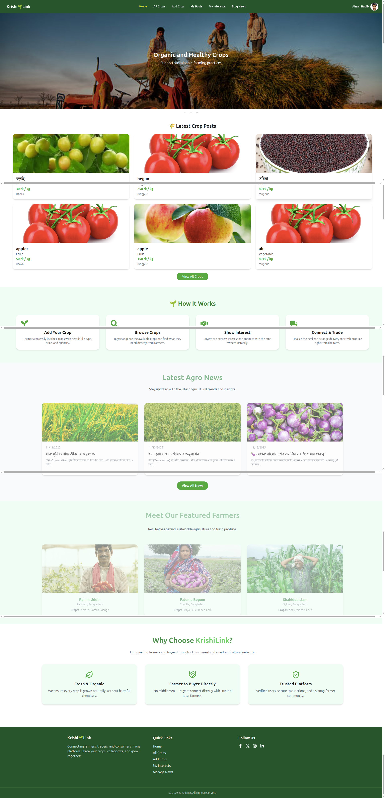
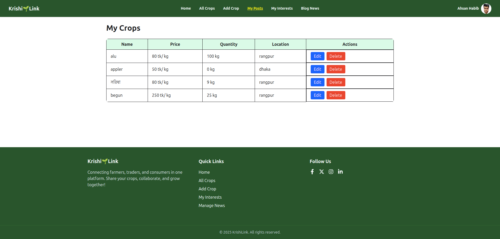

# 🌾 KrishiLink

Live Site URL: https://superlative-biscuit-1df894.netlify.app
server side: https://github.com/hahsan042/kirishi-link-server-side
client side:https://github.com/hahsan042/kirishilink-client
# About the Project

KrishiLink is a modern agricultural platform that connects farmers and buyers directly.
Farmers can post their crops, and buyers can express interest and purchase fresh produce easily.

# Features

🌱 Crop Marketplace: Farmers can add crop listings with details like name, type, price, and quantity.

💬 Buyer Interest System: Buyers can show interest and communicate directly with farmers.

📰 Agro News Section: Latest agricultural news and updates with CRUD (create, update, delete) functionality.

👩‍🌾 Featured Farmers: Highlights top farmers and their best products.

🔒 Secure Authentication: Firebase Authentication (Email & Google Sign-in).

📱 Responsive Design: Fully optimized for mobile, tablet, and desktop.

# Technologies Used

Frontend: React.js, Vite, Tailwind CSS, DaisyUI, Framer Motion

Backend: Node.js, Express.js, MongoDB

Authentication: Firebase

Hosting: Vercel (Client) & Vercel/Render (Server)

# Screenshots

(You can add screenshots later — for example)

👨‍💻 Developer

Md. Ahsan Habib
📧 Email: [eee1916054brur@gmail.com]
